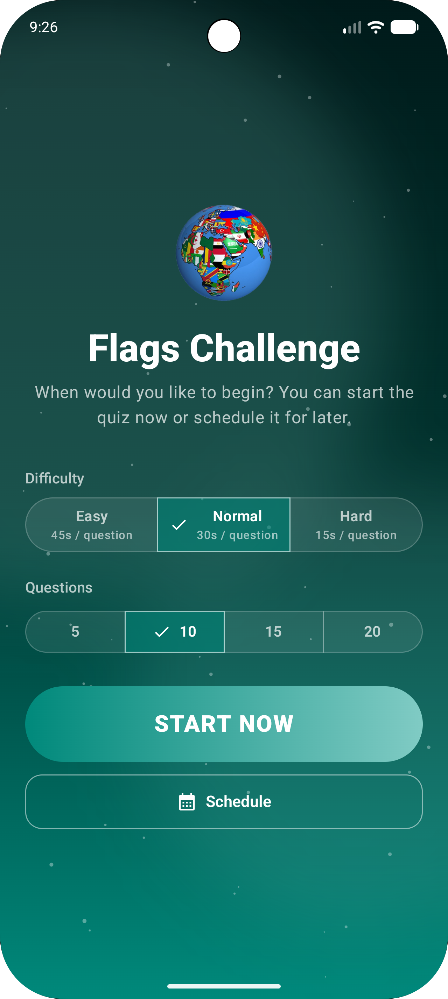
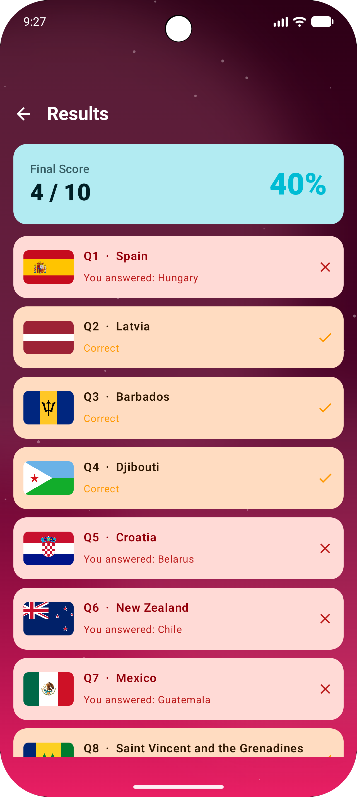
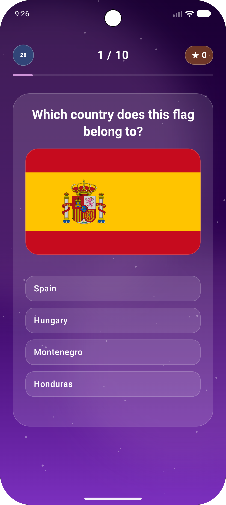
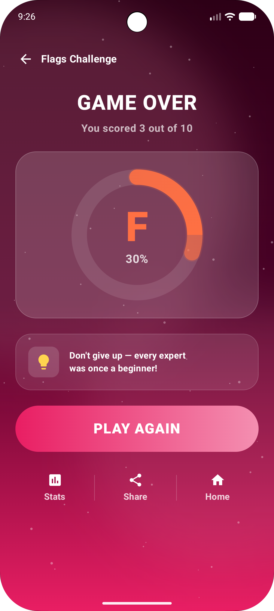

# 🇺🇳 FlagMaster

> An Android quiz game where you race against the clock to identify world flags. Pick a difficulty, choose how many questions, schedule a challenge or jump straight in — then answer timed questions backed by persistent state that survives app kills.

---

## 📸 Screenshots

|                         Start                          |                      Countdown                      |                          Question                           |                        Game Over                         |
|:------------------------------------------------------:|:---------------------------------------------------:|:-----------------------------------------------------------:|:--------------------------------------------------------:|
|  |  |  |  |

---

## ✨ Features

- **Leaderboard** — Competitive ranking system based on points, streaks, and difficulty
- **Profile Customization** — Personalize your presence with display names and avatars (DiceBear or gallery)
- **Mandatory Profile Setup** — Seamless onboarding for new users to set their identity
- **Configurable difficulty** — Easy (45 s), Normal (30 s), or Hard (15 s) per question
- **Configurable length** — 5, 10, 15, or 20 questions per game
- **Time-scheduled challenge** — Optionally set an exact HH:MM:SS start time; the app counts down and auto-starts
- **Country facts** — After each answer the correct country's fun fact is displayed for 10 seconds
- **10-second fact countdown** — "Next question" button shows a live draining timer; tap any time to skip early
- **Vibrant themes** — 8 glassmorphic colour schemes (Blue, Orange, Purple, Green, Rose, Indigo, Teal, Sunset) that change per game state
- **Flag recognition** — One SVG flag image, four country options per question
- **Instant feedback** — Correct answer highlighted in cyan, wrong selection highlighted in red with ✕ icon
- **Live score** — Header shows running score and progress throughout the quiz
- **Persistent state** — DataStore-backed; the quiz resumes at the right question even after an app kill
- **Animated results screen** — Game over screen with grade ring (S/A/B/C/F) and percentage arc
- **Unanswered questions** — Auto-marked incorrect when the timer expires

---

## 🎮 Game Flow

```
Start screen
(pick difficulty + question count, optional schedule)
        │
        ▼
  Waiting screen            ← only when a future time is scheduled
  (shows scheduled time)
        │
        ▼  20 seconds before start
  Countdown ring (20 → 0)
        │
        ▼
  Question  ──[timed bar]──►  Answer revealed
        │                      └─ correct/wrong highlight
        │                      └─ country fact panel
        │                      └─ "Next question (Xs)" button
        │                            (auto-advance after 10 s)
        └──────────── × N questions
        │
        ▼
   Game Over + Grade + Score
```

---

## 🏗 Architecture

Six Gradle modules following **Clean Architecture** with feature-based modularization:

```
FlagMaster/
├── app/              # Shell — FlagsNavigation, MainActivity, FlagsApplication (Coil/Hilt setup)
├── domain/           # Pure Kotlin/JVM — models, repository interfaces, use cases
├── data/             # Android library — Room, DataStore, Firebase Auth/Firestore implementations
├── feature/
│   ├── flags/        # Quiz gameplay: FlagsChallengeViewModel, SyncViewModel, all quiz screens
│   ├── auth/         # Email/password + Google Sign-In with Credential Manager
│   ├── leaderboard/  # Real-time Firestore-backed ranking with top 3 podium
│   └── profile/      # Profile setup onboarding and profile display screen
└── core/
    └── ui/           # Shared composables (ConfettiShower, Shimmer) + VibrantTheme system
```

### Key patterns

| Pattern | Detail |
|---|---|
| **Feature modularization** | Each product surface (flags, auth, leaderboard, profile) is its own Gradle module; `:app` is a thin shell |
| **Clean Architecture layers** | `domain` → pure JVM (no Android); `data` → Android lib; `feature/*` → Compose UI + ViewModel |
| **Type-safe navigation** | `kotlinx-serialization` typed routes across all nav graphs |
| **Credential Manager** | Modern Google Sign-In via `GetSignInWithGoogleOption` (no legacy `GoogleSignInClient`) |
| **Single source of truth** | `MutableStateFlow<ScheduleTimeUiState>` in `FlagsChallengeViewModel` |
| **Sealed actions** | `FlagsScreenAction` for type-safe UI → ViewModel events |
| **Separate timer jobs** | `timerJob` (per-question countdown) and `advanceJob` (10 s fact delay) are independently cancellable, enabling early skip without cancelling the wrong job |
| **Suspend use cases** | Each domain operation is a single-responsibility `suspend` class |
| **IO-dispatched repository** | All DB and asset I/O runs on `Dispatchers.IO` via `withContext` |
| **Coroutine-based timer** | Countdowns use `suspend fun runCountdown()` + coroutine `Job` instead of `CountDownTimer` |
| **Shared theme via core:ui** | `VibrantTheme` in `:core:ui` consumed by all feature modules |

---

## 🎨 Theme System

All visual config lives in `core/ui/src/main/java/org/smp/core/ui/VibrantTheme.kt` as `VibrantThemeConfig` data class instances. Eight built-in themes:

| Name                 | Primary colour        | Used when                             |
|----------------------|-----------------------|---------------------------------------|
| `TealVibrantTheme`   | Teal `#00897B`        | Not scheduled                         |
| `BlueVibrantTheme`   | Cyan `#00BCD4`        | Scheduled / waiting                   |
| `OrangeVibrantTheme` | Amber `#FF9800`       | Countdown                             |
| `PurpleVibrantTheme` | Purple `#7B2FBE`      | In progress (score % 3 == 0)          |
| `SunsetVibrantTheme` | Deep orange `#FF5722` | In progress (score % 2 == 0)          |
| `IndigoVibrantTheme` | Indigo `#3D5AFE`      | In progress (otherwise)               |
| `RoseVibrantTheme`   | Pink `#E91E63`        | Completed                             |
| `GreenVibrantTheme`  | Green `#00C853`       | Available via `allVibrantThemes` list |

`allVibrantThemes` exposes the full list for cycling through themes per question score.

---

## 🛠 Tech Stack

| Layer         | Library                                              | Version          |
|---------------|------------------------------------------------------|------------------|
| UI            | Jetpack Compose BOM                                  | 2026.03.01       |
| Navigation    | Type-Safe Navigation Compose                         | 2.9.7            |
| Auth          | Firebase Auth + Credential Manager                   | 1.6.0            |
| Database      | Room + Cloud Firestore                               | 26.2.0           |
| State         | ViewModel + StateFlow                                | Lifecycle 2.10.0 |
| DI            | Hilt                                                 | 2.59.2           |
| Persistence   | DataStore Preferences                                | 1.2.1            |
| Image loading | Coil (SVG support)                                   | 3.4.0            |
| Serialization | kotlinx-serialization                                | 1.11.0           |
| Logging       | Timber                                               | 5.0.1            |
| Testing       | JUnit Jupiter                                        | 6.0.3            |
| Build         | AGP 9.1.1 · Gradle 9.4.1 · Kotlin 2.3.20 · KSP 2.3.6 | —                |
| Min SDK       | Android 7.0 (API 24)                                 | —                |
| Target SDK    | Android 15 (API 36)                                  | —                |

---

## 💾 Persistent State

DataStore stores two keys:

| Key              | Type            | Purpose                                       |
|------------------|-----------------|-----------------------------------------------|
| `challenge_time` | `Long`          | Epoch millis of the scheduled start           |
| `quiz_answers`   | `String` (JSON) | `List<QuizAnswer>` — answers submitted so far |

On every launch the app reconciles current time against the saved challenge time:

- **Before start** → shows the scheduled time
- **In progress** → calculates the current question index from elapsed time and resumes
- **Expired** (> N × 40 s after start, where N = question count) → clears state automatically

---

## 🔄 Data Sync

Question data is served from three sources in priority order:

```
Firebase RTDB  ──(online)──►  Room cache  ──►  App (live questions)
                                  │
               ──(offline)────────┘
                                  │
               ──(no cache)───────┴──►  Bundled assets (questions.json)
```

### Sources

| Source                     | Class                 | When used                            |
|----------------------------|-----------------------|--------------------------------------|
| Firebase Realtime Database | `FirebaseDataSource`  | Network available                    |
| Room (cache)               | `FlagsRepositoryImpl` | Firebase unreachable but DB has rows |
| Bundled assets             | `AssetDataSource`     | No network and empty DB              |

### Background sync

`SyncViewModel` (scoped to `FlagsNavigation`) owns all sync lifecycle:

| Trigger                                | Action                                                |
|----------------------------------------|-------------------------------------------------------|
| App launch                             | Immediate one-time sync + schedule periodic 24 h sync |
| App goes to background (`ON_STOP`)     | Pause periodic sync                                   |
| App returns to foreground (`ON_START`) | Resume periodic sync                                  |

`FirebaseBackgroundSyncManager` translates these into WorkManager tasks (network-constrained, exponential backoff on failure).

---

## 🗂 Project Structure

```
app/src/main/java/org/smp/flagmaster/
├── FlagsApplication.kt              # Coil SvgDecoder + Hilt app entry point
├── FlagsNavigation.kt               # Root NavHost wiring all feature nav graphs
└── MainActivity.kt

app/src/main/assets/
├── questions.json                   # Seed data (255 questions with facts)
└── flags/                           # 255 SVG flag files (ISO 3166-1 alpha-2)

feature/flags/src/main/java/org/smp/feature/flags/
├── FlagsChallengeViewModel.kt       # Quiz game logic, timers, advance/skip
├── FlagsUiState.kt                  # ScheduleTimeUiState, AnswerResult, ChallengeState
├── FlagsScreenAction.kt             # Sealed UI event class
├── FlagsScreen.kt                   # Top-level screen composable
├── FlagsScreenNavigation.kt
├── SoundManager.kt                  # Quiz sound effects
├── theme/                           # Feature-local colour/type tokens (delegates to core:ui)
├── sync/SyncViewModel.kt            # Firebase sync lifecycle
├── mapper/                          # ChallengeTimeMapper, TimeSchedulerErrorMapper
└── components/
    ├── StartChallengeScreen.kt      # Difficulty + question count picker, optional scheduler
    ├── CountDownView.kt             # Animated ring countdown (20 s before start)
    ├── QuestionScreen.kt            # Wires state → VibrantChallengeView + fact countdown
    ├── VibrantChallengeView.kt      # Glassmorphic question card, options, fact panel, CTA
    ├── GameOverScreen.kt            # Grade ring, score, share / play-again actions
    ├── StatsScreen.kt               # Per-question answer review
    └── ...

feature/auth/src/main/java/org/smp/feature/auth/
├── AuthViewModel.kt
├── LoginScreen.kt
├── CredentialManagerGoogleAuthProvider.kt   # Modern Google Sign-In
└── AuthNavigation.kt

feature/leaderboard/src/main/java/org/smp/feature/leaderboard/
├── LeaderboardViewModel.kt
├── LeaderboardScreen.kt
└── navigation/LeaderboardNavigation.kt

feature/profile/src/main/java/org/smp/feature/profile/
├── ProfileScreen.kt
├── ProfileSetupScreen.kt
└── navigation/ProfileNavigation.kt

core/ui/src/main/java/org/smp/core/ui/
├── VibrantTheme.kt                  # VibrantThemeConfig + 8 named theme instances
├── VibrantBackground.kt
├── ConfettiShower.kt
└── Shimmer.kt

domain/src/main/java/org/smp/domain/
├── model/          # Question, Country, QuizAnswer, AuthUser, UserStats, DifficultyMode
├── repository/     # FlagsRepository, AuthRepository, LeaderboardRepository interfaces
└── usecase/        # One class per operation (answers/, challenge/, questions/, auth/, leaderboard/)

data/src/main/java/org/smp/data/
├── database/           # Room DB, DAOs, entities
├── datastore/          # DataStore read/write
├── firebase/           # FirebaseDataSource (RTDB questions)
├── auth/               # FirebaseAuthRepository
├── sync/               # FirebaseBackgroundSyncManager
└── repository/         # FlagsRepositoryImpl, FirebaseLeaderboardRepository
```

---

## 🚀 Getting Started

1. **Clone the repo**
   ```bash
   git clone https://github.com/sougandhmp/FlagMaster.git
   cd FlagMaster
   ```

2. **Open in Android Studio** (Meerkat or later recommended)

3. **Run on a device or emulator** targeting API 24+
   ```bash
   ./gradlew :app:installDebug
   ```

> The app seeds its question data from `app/src/main/assets/questions.json` on first launch — no network required.

---

## 🖼 Flag Assets

255 flag SVGs live in `app/src/main/assets/flags/`, named by lowercase ISO 3166-1 alpha-2 country code:

```
ad.svg   ae.svg   af.svg   ...   us.svg   gb.svg   fr.svg   ...
```

Loaded at runtime by Coil with a `SvgDecoder` registered in `FlagsApplication`:

```kotlin
data("file:///android_asset/flags/${countryCode.lowercase()}.svg")
```
