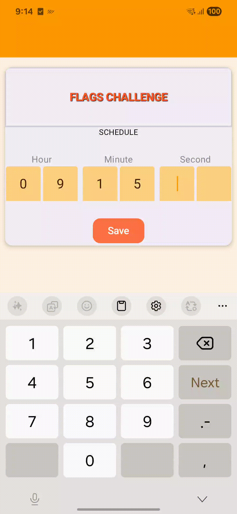

# 🇺🇳 FlagMaster

> An Android quiz game where you race against the clock to identify world flags. Schedule a challenge, survive a countdown, and answer 15 timed questions — all with persistent state that survives app kills.

---

## 📸 Screenshots

| Time Scheduler | Countdown | Question | Game Over |
|:-:|:-:|:-:|:-:|
|  |  |  |  |

## 🎥 Demo

| Full App Flow | Persistence After App Kill |
|:-:|:-:|
|  |  |

---

## ✨ Features

- **Time-scheduled challenge** — Set an exact HH:MM:SS start time; the app counts down and auto-starts
- **15 timed questions** — 30 seconds per question, followed by a 10-second feedback interval
- **Flag recognition** — One flag image, four country options per question
- **Visual feedback** — Correct/wrong answer highlighting after each question
- **Persistent state** — Powered by DataStore; the quiz resumes at the right question even after an app kill
- **Score tracking** — Final score shown with percentage and animated results screen
- **Unanswered questions** — Auto-marked incorrect when the timer expires

---

## 🎮 Game Flow

```
Schedule time (HH:MM:SS)
        │
        ▼
  Waiting screen
  (shows scheduled time)
        │
        ▼  20 seconds before start
  Countdown (00:20 → 00:00)
        │
        ▼
  Question 1 of 15  ──[30s timer]──►  Answer revealed (10s)
        │                                      │
        └──────────────────────────────────────┘
                    × 15 questions
        │
        ▼
   Game Over + Score
```

---

## 🏗 Architecture

The project follows **Clean Architecture** split across three Gradle modules:

```
FlagMaster/
├── app/          # Presentation — Jetpack Compose UI, ViewModels
├── domain/       # Business logic — models, use cases, repository interface
└── data/         # Infrastructure — Room DB, DataStore, asset loading
```

### Key patterns
- **Single source of truth** — `MutableStateFlow<ScheduleTimeUiState>` in the ViewModel
- **Sealed actions** — `FlagsScreenAction` for type-safe UI events
- **Suspend use cases** — each domain operation is a single-responsibility suspend class
- **IO-dispatched repository** — all DB and asset I/O runs on `Dispatchers.IO` via `withContext`

---

## 🛠 Tech Stack

| Layer | Library | Version |
|---|---|---|
| UI | Jetpack Compose BOM | 2025.07.00 |
| Navigation | Navigation Compose | 2.9.2 |
| State | ViewModel + StateFlow | Lifecycle 2.9.2 |
| DI | Hilt | 2.57 |
| Database | Room | 2.7.2 |
| Persistence | DataStore Preferences | 1.1.7 |
| Image loading | Coil | 3.3.0 |
| Serialization | Gson | 2.13.1 |
| Logging | Timber | 5.0.1 |
| Build | AGP 9.1.1 · Gradle 9.3.1 · Kotlin 2.2.10 | KSP 2.3.2 |
| Min SDK | Android 7.0 (API 24) | — |
| Target SDK | Android 15 (API 36) | — |

---

## 💾 Persistent State

DataStore stores two keys:

| Key | Type | Purpose |
|---|---|---|
| `challenge_time` | `Long` | Epoch millis of the scheduled start |
| `quiz_answers` | `String` (JSON) | `List<QuizAnswer>` — answers so far |

On every launch the app reconciles current time against the saved challenge time:

- **Before start** → shows the scheduled time
- **In progress** → calculates the current question index from elapsed time and resumes
- **Expired** (> 15 × 40s after start) → clears state automatically

---

## 🗂 Project Structure

```
app/src/main/java/org/smp/flagmaster/
├── ui/
│   ├── FlagsChallengeViewModel.kt   # All game logic & state
│   ├── FlagsScreen.kt               # Root composable + state routing
│   ├── FlagsUiState.kt              # State, enums, sealed classes
│   ├── FlagsScreenAction.kt         # User action sealed class
│   ├── mapper/
│   │   └── TimeSchedulerErrorMapper.kt
│   └── components/
│       ├── TimerScheduleView.kt     # HH:MM:SS digit input
│       ├── ChallengeScheduledView.kt
│       ├── CountDownView.kt
│       ├── ChallengeView.kt         # Flag + answer grid
│       ├── GameOverScreen.kt        # Animated results screen
│       └── ...

domain/src/main/java/org/smp/domain/
├── model/          # Question, Country, QuizAnswer
├── repository/     # FlagsRepository interface
└── usecase/        # One class per operation

data/src/main/java/org/smp/data/
├── database/       # Room DB, DAOs, entities
├── datastore/      # DataStore read/write
├── asset_data_source/  # questions.json loader
└── repository/     # FlagsRepositoryImpl
```

---

## 🚀 Getting Started

1. **Clone the repo**
   ```bash
   git clone https://github.com/sougandhmp/FlagMaster.git
   cd FlagMaster
   ```

2. **Open in Android Studio** (Meerkat or later recommended)

3. **Run on a device or emulator** targeting API 24+
   ```bash
   ./gradlew :app:installDebug
   ```

> The app seeds its question data from `app/src/main/assets/questions.json` on first launch — no network required.

---

## 🖼 Flag Assets

Flag drawables live in `app/src/main/res/drawable/` and are named by lowercase ISO 3166-1 alpha-2 country code:

```
us.xml   gb.xml   fr.xml   jp.xml   de.xml   in.xml   ...
```

The `CountryFlag` composable resolves them at runtime via `getIdentifier(countryCode, "drawable", packageName)`.
